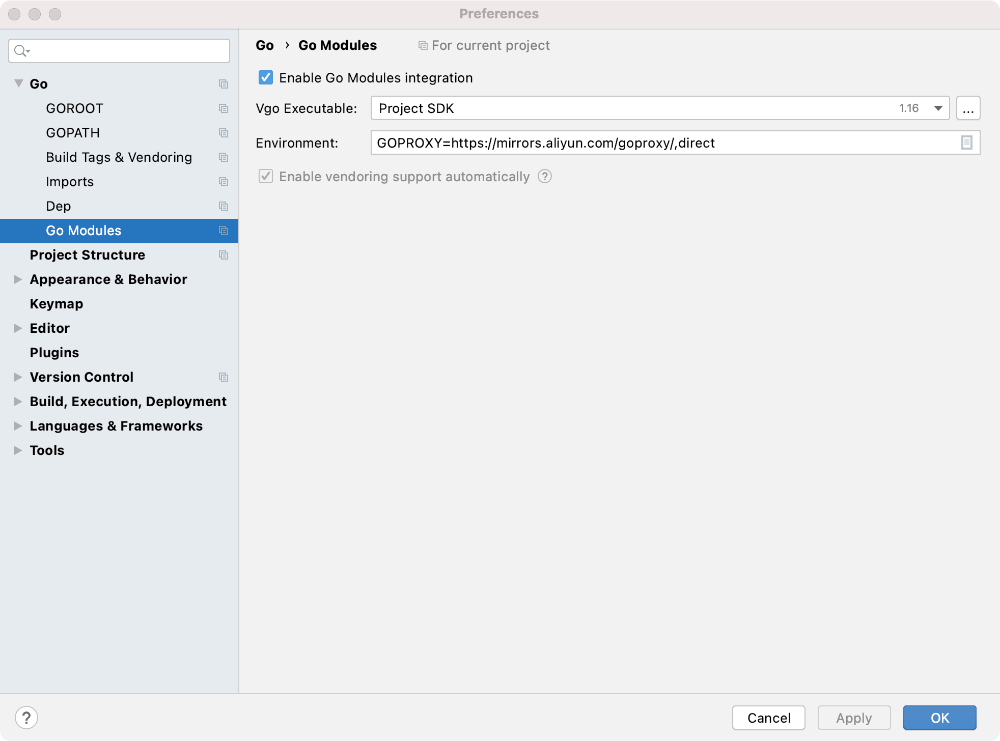
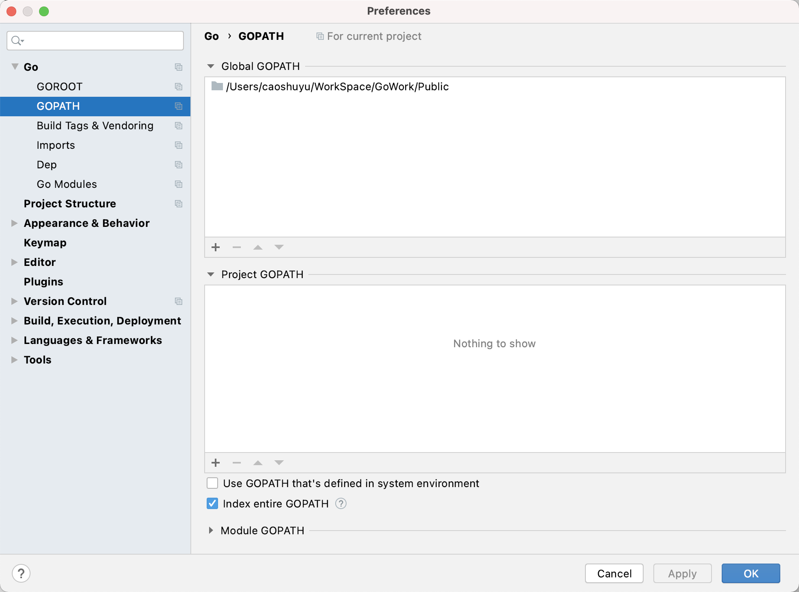

# Go语言安装

Go在新版本中已废弃原有的GOPATH安装方式，新的版本中可以直接使用gomod安装

## <a id="gomod">gomod 安装</a>
gomod进行get下载经常会遇到因为某些大家都知道的原因无法下载国外的一些资源，所以需要设置代理，这里比较推荐使用阿里的代理，设置地址：
```text
export GOPROXY=https://mirrors.aliyun.com/goproxy/,direct
```

### 下载的时候报错处理
1. could not read Username
   
    使用https://gitee.com/仓库报错could not read Username for 'https://gitee.com': terminal prompts disabled修改环境变量
    ```text
    export GIT_TERMINAL_PROMPT=1
    ```

### 在Goland中设置
1. 设置代理路径 preferences -> Go Modules
   

1. 设置Go Modules存储路径
   
   具体的model存储路径：设置的第一个路径后加/pkg/mod，如果有哪个包下载到一半失败需要重新下载可以先到这个目录下把对应的包删除，例如 github.com/caoshuyu/kit 包的存储地址在/pkg/mod/github.com/caoshuyu/这个目录下，会有kit@version版本号的对应包。

### 已有项目使用gomod
如果需要对一个已经存在的项目启用go module，可以按照以下步骤操作：
1. 在项目目录下执行go mod init，生成一个go.mod文件。
2. 执行go get，查找并记录当前项目的依赖，同时生成一个go.sum记录每个依赖库的版本和哈希值。

### 新项目使用gomod
对于一个新创建的项目，我们可以在项目文件夹下按照以下步骤操作：
1. 执行go mod init 项目名命令，在当前项目文件夹下创建一个go.mod文件。
2. 手动编辑go.mod中的require依赖项或执行go get自动发现、维护依赖。

### gomod命令
1. 查询项目所使用的所有包
   ```shell
    go list -m -json all
   ```
2. 获取所有使用包
    ```shell
    go get -u all
    ```


